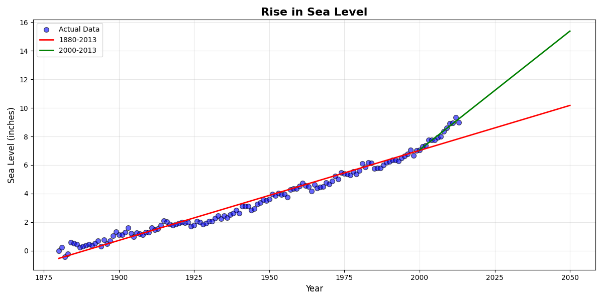
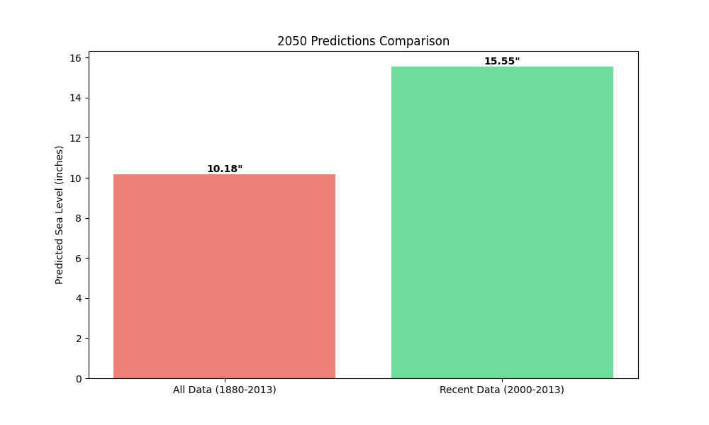

# 🌊 Sea Level Predictor

> **freeCodeCamp Data Analysis with Python - Project 5/5 (FINAL!)**

Predict global sea level rise through 2050 using linear regression on historical data (1880-2013).


---

## 🎯 Project Overview

Analyze **133 years** of sea level data to:
- 📈 Visualize historical sea level rise
- 🔮 Predict future levels using linear regression
- 🚀 Compare long-term vs recent trends
- ⚠️ Identify acceleration in rise rate

---

## 📦 Deliverables

### ✅ Required (freeCodeCamp)

**Main Plot   :** `data/files/sea_level_plot.png`
- Scatter plot of actual data (1880-2013)
- **Red line  :** Best fit using ALL data → extends to 2050
- **Green line:** Best fit using RECENT data (2000+) → extends to 2050

### 🎁 Bonus Analyses

1. **Prediction Comparison** — Bar chart showing 2050 predictions
2. **Acceleration Analysis** — Is sea level rise speeding up?
3. **Milestone Predictions** — When will we hit 10", 15", 20"?
4. **Statistical Summary**   — R², p-values, slopes

---

## 📊 Visualizations Gallery

### 🔴 Main Plot (Required for freeCodeCamp)

**File:** `data/files/sea_level_plot.png`



**What you see:**
- 🔵 **Blue dots        :** Actual sea level measurements (1880-2013)
- 🔴 **Red line         :** Long-term trend using ALL data (1880-2013) → extends to 2050
- 🟢 **Green dashed line:** Recent trend using data from 2000+ → extends to 2050
- ⭐ **Stars            :** 2050 predictions from both models

**Key Insight:** The green line is steeper than the red line, showing that sea level is rising **faster** in recent decades!

**Predictions for 2050:**
- Using long-term trend: ~10.18 inches
- Using recent trend   : ~15.55 inches
- Difference: **5.37 inches more** if acceleration continues!

---

### 📊 Bonus Visualization 1: Prediction Comparison

**File:** `data/files/prediction_comparison.png`



**Side-by-side comparison:**

| Model | Data Used | Rate | R² | 2050 Prediction |
|-------|-----------|------|----|----|
| **Model 1** | 1880-2013 | 0.059 in/yr | 0.982 | 10.18 inches |
| **Model 2** | 2000-2013 | 0.134 in/yr | 0.971 | 15.55 inches |

**Left plot :** Conservative long-term model  
**Right plot:** Shows recent acceleration (steeper slope)

**Finding   :** Recent rate is **2.26× faster** than historical average!

---

## 🚀 Quick Start

### Step 1: Install Dependencies

```bash
pip install pandas matplotlib scipy numpy
```

### Step 2: Choose Your Path

**✅ Complete Solution:**
```bash
python sea_level_predictor.py
```
Runs full analysis with bonus features.

**🧪 Test Mode:**
```bash
python main.py
```
Runs solution + unit tests.

---

## 📁 Project Structure

```
├── data
│   ├── files                             # 📊 Generated outputs
│   │   ├── prediction_comparison.png     # Bonus chart
│   │   └── sea_level_plot.png            # Required plot
│   └── epa-sea-level.csv                 # 📂 Dataset
├── .gitignore
├── LICENSE
├── README.md
├── main.py                               # 🧪 Test runner
├── requirements.txt
├── sea_level_predictor.py                # Main Analysis plus Bonus
└── test_module.py                        # Unit test from freeCoCp

*Generated by FileTree Pro Extension*
```

---

## 📊 Sample Output

```
�🎨 Generating required visualization.
   ✓ Main plot saved → data/files/sea_level_plot.png

�🎁 Running bonus analyses...
   ✓ Prediction comparison → data/files/prediction_comparison.png
Old rate: 0.0583 inches/year
New rate: 0.1664 inches/year
Acceleration: +185.7%

============================================================
�🎯 MILESTONE PREDICTIONS (based on 2000-2013 trend)
============================================================

Current sea level (2013): 8.98 inches

When will sea level reach:
  10 inches → Year 2018 (5 years from 2013)
  12 inches → Year 2030 (17 years from 2013)
  15 inches → Year 2048 (35 years from 2013)
  18 inches → Year 2066 (53 years from 2013)
  20 inches → Year 2078 (65 years from 2013)
============================================================

============================================================
�📊 STATISTICAL SUMMARY
============================================================

�🌊 ALL DATA (1880-2013):
   Slope:        0.063045 inches/year
   Intercept:    -119.0659
   R² (fit):     0.9697
   P-value:      3.79e-102
   Std Error:    0.000969
   2050 Prediction: 10.18 inches

�🔹 RECENT DATA (2000-2013):
   Slope:        0.166427 inches/year
   Intercept:    -325.7935
   R² (fit):     0.9531
   P-value:      2.44e-09
   Std Error:    0.010653
   2050 Prediction: 15.38 inches

�🔹 DIFFERENCE IN 2050 PREDICTIONS:
   +5.21 inches (51.2% difference)
============================================================

============================================================
✅ ALL ANALYSES COMPLETE!
============================================================

�📂 Generated files in data/files/:
   1. sea_level_plot.png         (Required for freeCodeCamp)
   2. prediction_comparison.png  (Bonus)

�📊 Key Findings:
   • Sea level rose 9.0 inches from 1880-2013
   Std Error:    0.010653
   2050 Prediction: 15.38 inches

�🔹 DIFFERENCE IN 2050 PREDICTIONS:
   +5.21 inches (51.2% difference)
============================================================

============================================================
   • Rise rate is +164.0% faster since 2000
   • 2050 prediction: 15.4 inches (recent trend)

============================================================
PS C:\Users\Soufiane Zekaoui\sfsea-level-predictor>

   • Rise rate is +164.0% faster since 2000
   • 2050 prediction: 15.4 inches (recent trend)
   • Rise rate is +164.0% faster since 2000
   • Rise rate is +164.0% faster since 2000
   • Rise rate is +164.0% faster since 2000
   • 2050 prediction: 15.4 inches (recent trend)

============================================================
```
---

## 📈 Understanding the Two Lines

### Why Two Predictions?

**Red Line (All Data):**
- Uses 133 years of data
- Assumes constant rate
- More conservative estimate

**Green Line (Recent Data):**
- Uses only 2000-2013 data
- Reflects current accelerated rate
- Higher 2050 prediction

### Which is More Accurate?

**If acceleration continues** → Green line more realistic  
**If rate stabilizes**        → Somewhere between red and green

---

## 💡 Customization Ideas

1. **Add confidence intervals** to predictions
2. **Compare with IPCC projections**
3. **Overlay historical climate events**
4. **Interactive dashboard** with Plotly
5. **Export PDF report** with all analyses

---

## 📚 Resources

- **freeCodeCamp Project:** [Sea Level Predictor](https://www.freecodecamp.org/learn/data-analysis-with-python data-analysis-with-python-projects/sea-level-predictor)
- **Dataset Source:** [EPA](https://github.com/freeCodeCamp/boilerplate-sea-level-predictor)

---

## 👨‍💻 Author

**Your Name**
- GitHub: [@soufianezekaoui](https://github.com/soufianezekaoui)
- LinkedIn: [Soufiane Zekaoui](https://linkedin.com/in/soufiane-zekaoui-445b1b352/)
- Portfolio: [My_Personal_Website.com](https://soufianezekaoui.github.io/my_soufianeze_portfolio/)

---
<div align="center">

**Made with 🌊 for climate awareness and data science education**

⭐ **Star this repo if it helped you!** ⭐

</div>
